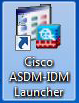
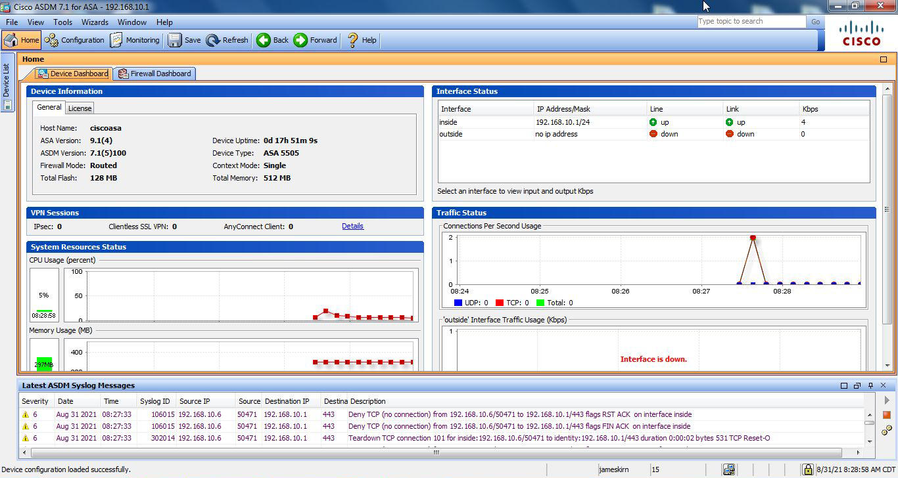

# Cisco ASDM

> The Cisco Adaptive Security Device Manager (ASDM) lets you manage Cisco Adaptive Security Appliance (ASA) firewalls and the Cisco AnyConnect Secure Mobility Client through a local, web-based interface.

## ASDM-IDM Interface
The IDM is a web-based, Java Web Start application that enables you to configure and manage your sensor (Cisco ASA). The web server for the IDM resides on the sensor (Cisco ASA). You can access it through Chrome or Firefox web browsers.

I am documenting this process as I have had difficulty in getting the ASDM-IDM software to work with with the most recent versions of Oracle JRE. I discovered that you are best to use the Oracle JRE 7.45 release to avoid going through many (complicated and error prone) steps. This version is available from the [Oracle archive web site](https://www.oracle.com/java/technologies/javase/javase7-archive-downloads.html). You will need to sign up with Oracle to download it. I have download the x64 version (jre-7u45-windows-x64.exe) and it is available as a zip archive in this repository.

> **Note:** A Cisco ASA needs to be configured to initially be available on your system. Normal installation is done through the console port and it involves many CLI commands. These steps are not covered in this write up. It is assumed you have performed these steps and are only attempting to get the ASDM-IDM web application up and running. See reference 1 below for initial ASA CLI configuration steps.

## Prerequisites
- Windows 7 or 10 PC
- Oracle JRE 7.45 - many others will not work
- A configured and working Cisco ASA (I use a Cisco ASA 5505)

## Install Steps
- 1. Install JRE 7.45
- 2. Download and Install ADSM-IDM Java Web Application

### Install Oracle JRE 7.45
**Step 1:** Download and Install Oracle JRE 7.45

A copy of the Oracle JRE 7.45 can be downloaded from my repository via this [link](https://github.com/jjkirn/asdm/).

Once you have downloaded it, just un-zip it and install it.

### Download and Install ASDM-IDM Java Web Application
**Step 2:** Install the Cisco ASDM Launcher:

Open a web browser window to the IP address of your Cisco ASA. You should see something similar to:

Click on the "Install ASDM Launcher" to install the ASDM-IDM Java application. You will be prompted for the user and password for the web interface for the ASA. After you successfully complete the login you will be rewarded with an installer file in your "Downloads" folder called "dm-launcher.msi". 

Install the "dm-launcher.msi" application and you should see the following:

Once the install is complete you should have a link on your desktop labeled "Cisco ASDM-IDM Launcher".

Click on the link to launch the ASDM-IDM Java web application. You may get an "Untrusted message" as follows:

Just click on "Continue" to complete the application launch.

Next you should be prompted with the login page from the ASDM-IDM application:

After you enter the "Device IP Address" of you Cisco ASA and your Username and Password the
the Java application successful launch should look like:

At this point you are now able to modify/change/add to the Cisco ASA configuration using a GUI interface. Enjoy!

### References
1. [Cisco ASA CLI](https://www.cisco.com/c/en/us/td/docs/security/asa/asa910/configuration/general/asa-910-general-config/ref-cli.html)
2. [Cisco ASA ASDM Configuration Guide](https://www.cisco.com/c/en/us/td/docs/security/asa/asa96/asdm76/general/asdm-76-general-config/intro-start.html)
3. [Oracle Java SE Runtime Environment 7u45](https://www.oracle.com/java/technologies/javase/javase7-archive-downloads.html)

End of Document

